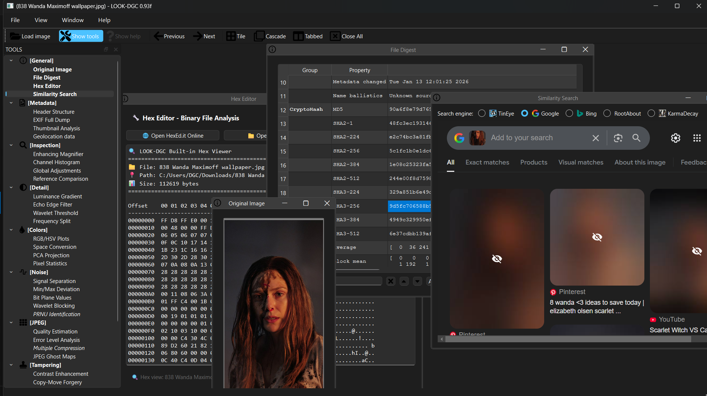
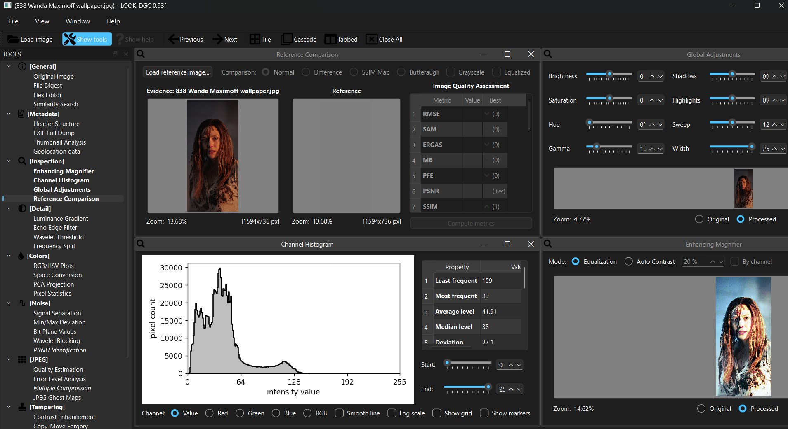
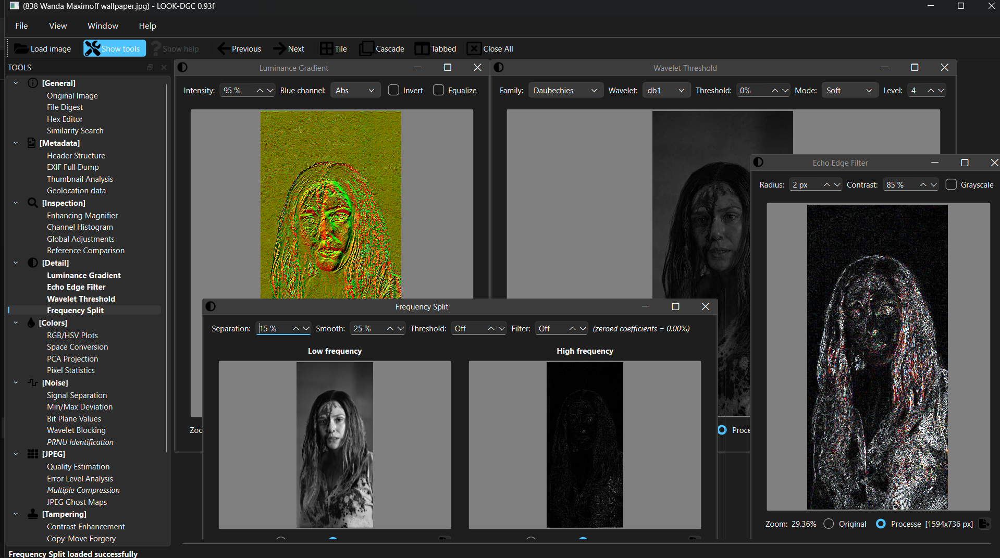
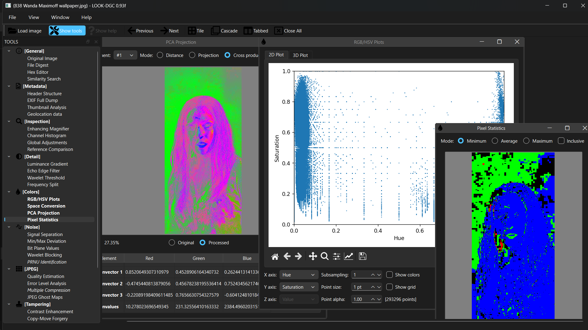
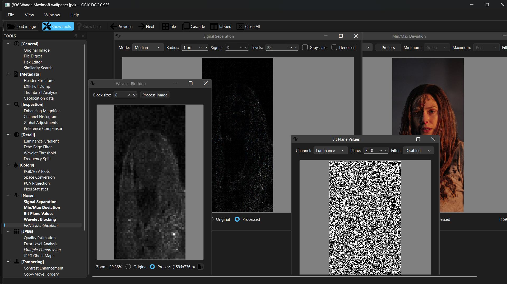
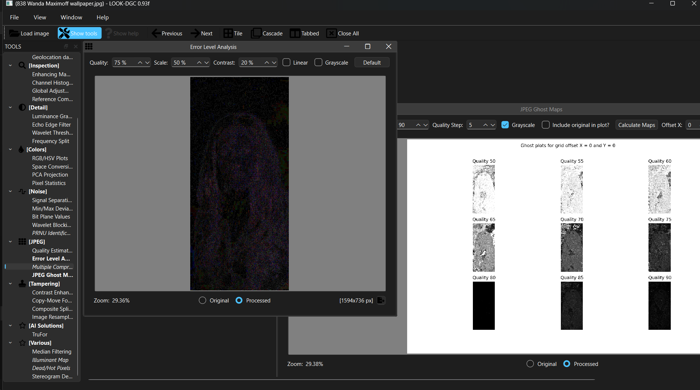
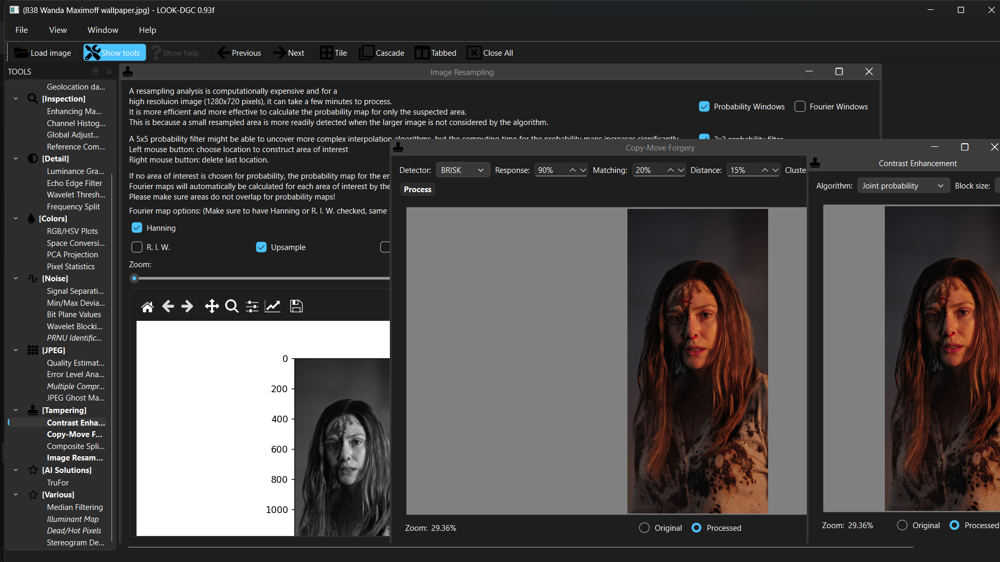

<p align="center">
  
  <br><b>🔍 An Open Source Digital Image Forensics Toolkit</b>
</p>

<p align="center">
  
  
  
  
  
</p>

---

## 📋 Table of Contents

- [🎯 Introduction](#-introduction)
- [🚀 Quick Start](#-quick-start)
- [⚡ Features](#-features)
- [📸 Screenshots](#-screenshots)
- [💻 Installation](#-installation)
- [🐳 Docker Setup](#-docker-setup)
- [📚 Documentation](#-documentation)
- [🤝 Contributing](#-contributing)

---

## 🎯 Introduction

> *"Forensic Image Analysis is the application of image science and domain expertise to interpret the content of an image and/or the image itself in legal matters."* - Scientific Working Group on Imaging Technologies

**LOOK-DGC** is a comprehensive digital image forensics toolkit developed by **Gopichand**. It provides a fully integrated environment for analyzing digital images to detect tampering, forgery, and manipulation.

### 🌟 Why LOOK-DGC?

- **🔓 Open Source**: Free and accessible to everyone
- **🎓 Educational**: Learn digital forensics techniques
- **🔬 Research-Ready**: Implement latest algorithms from research papers
- **🛡️ Professional**: Used by investigators and security professionals
- **🌍 Community-Driven**: Democratizing image forensics tools worldwide

---

## 🚀 Quick Start

### Option 1: Docker (Recommended)
```bash
# Clone the repository
git clone https://github.com/Gooichand/LOOK-DGC.git
cd LOOK-DGC

# For platform-specific Docker setup instructions, see DOCKER_README.md
```

### Option 2: Direct Installation
```bash
# Clone and setup
git clone https://github.com/Gooichand/LOOK-DGC.git
cd LOOK-DGC

# Windows
Launch-Look-DGC.bat

# Linux/macOS
./launch-look-dgc.sh
```

---

## ⚡ Features

### 🖥️ **Modern Interface**
- **🎨 Qt-based GUI**: Professional multi-window management
- **📁 Format Support**: JPEG, PNG, TIFF, BMP, WebP, PGM, PFM, GIF
- **⚡ Responsive Viewer**: Real-time pan, zoom, and navigation
- **🔄 Interactive Analysis**: Live algorithm parameter adjustment
- **📊 Export Capabilities**: Visual and textual result export
- **❓ Built-in Help**: Comprehensive tutorials and explanations


### 🤖 AI Solutions (TruFor)

LOOK-DGC includes an **AI Solutions** tool group featuring **TruFor**, an AI-based image forensic tool.

**TruFor** is designed to:
- Detect image manipulations using deep learning methods
- Complement traditional forensic tools with data-driven analysis
- Provide probabilistic insights rather than deterministic decisions

⚠️ **Note:** AI-based results may have limitations depending on image quality, dataset bias, and model assumptions. TruFor outputs should be interpreted alongside traditional forensic analyses.

### 🛠️ **Analysis Tools**

<details>
<summary><b>📋 General Tools</b></summary>

- **📷 Original Image**: Unaltered reference display
- **🔐 File Digest**: Cryptographic hashes and file information
- **⚙️ Hex Editor**: Raw byte-level file examination
- **🔍 Similar Search**: Online reverse image search integration

</details>

<details>
<summary><b>📊 Metadata Tools</b></summary>

- **🏗️ Header Structure**: Interactive file structure visualization
- **📋 EXIF Full Dump**: Complete metadata extraction and analysis
- **🖼️ Thumbnail Analysis**: Embedded thumbnail comparison
- **🌍 Geolocation Data**: GPS coordinate mapping and visualization

</details>

<details>
<summary><b>🔬 Inspection Tools</b></summary>

- **🔍 Enhancing Magnifier**: Forgery-detection enhanced magnification
- **📈 Channel Histogram**: RGB/composite histogram analysis
- **⚖️ Global Adjustments**: Brightness, hue, saturation manipulation
- **↔️ Reference Comparison**: Synchronized dual-image comparison

</details>

<details>
<summary><b>🎨 Color Analysis</b></summary>

- **📊 RGB/HSV Plots**: Interactive 2D/3D color space visualization
- **🔄 Space Conversion**: Multiple color space transformations
- **🧮 PCA Projection**: Principal component analysis projection
- **📏 Pixel Statistics**: Comprehensive per-pixel statistical analysis

</details>

<details>
<summary><b>📡 Noise Analysis</b></summary>

- **🔊 Noise Separation**: Multi-type noise component extraction
- **📊 Min/Max Deviation**: Block-based statistical deviation analysis
- **🔢 Bit Plane Analysis**: Individual bit layer examination
- **🆔 PRNU Identification**: Camera sensor pattern noise analysis

</details>

<details>
<summary><b>📷 JPEG Analysis</b></summary>

- **📊 Quality Estimation**: Quantization table analysis
- **⚡ Error Level Analysis**: Compression level difference visualization
- **🔄 Multiple Compression**: Machine learning compression detection
- **👻 JPEG Ghost Maps**: Compression artifact trace visualization

</details>

<details>
<summary><b>⚠️ Tampering Detection</b></summary>

- **📋 Copy-Move Forgery**: Feature descriptor cloning detection
- **✂️ Composite Splicing**: DCT statistical splicing detection
- **🔄 Image Resampling**: 2D interpolation trace detection
- **🎛️ Contrast Enhancement**: Color distribution manipulation analysis

</details>

<details>
<summary><b>🔧 Additional Tools</b></summary>

- **🔍 Median Filtering**: Nonlinear filtering trace detection
- **💡 Illuminant Mapping**: 3D surface light direction estimation
- **🔴 Dead/Hot Pixels**: Sensor defect detection and correction
- **👁️ Stereogram Decoder**: Hidden 3D image extraction

</details>

### 📄 **PDF Report Generation**

LOOK-DGC supports generating detailed PDF reports from analysis tools that provide structured data. The following tools include PDF export capabilities:

- **📷 Original Image**: Baseline image display with metadata summary
- **📊 Histogram Analysis**: Statistical data, channel information, and histogram plot visualization
- **🏗️ Header Structure**: File header analysis summary and metadata overview
- **🔊 Noise Analysis**: Noise estimation parameters, processing settings, and processed image

To generate a PDF report, select the desired analysis tools and use the "Generate Report" option from the File menu.

---
---

## 📁 Project Structure

Below is an overview of the main folders and files in the LOOK-DGC repository to help new contributors understand the codebase easily:

```text
LOOK-DGC/
├── gui/                  # Main GUI application source code
│   ├── modules/          # Core forensic analysis modules
│   └── ui/               # Qt UI layouts and components
├── images/               # Sample input images
├── output/               # Generated analysis results
├── demo-ss/              # Screenshots for README
├── docker/               # Docker configuration files
├── Launch-LOOK-DGC.bat   # Windows launcher
├── launch-look-dgc.sh    # Linux/macOS launcher
├── docker-compose.yml    # Docker Compose config
├── Dockerfile            # Docker build file
├── LICENSE               # MIT License
├── README.md             # Project documentation
└── HOW_IT_WORKS.md       # Forensic workflow explanation


## 📸 Screenshots

<p align="center">
  
  <br><b>📋 General Tools</b>: Original Image, File Digest, Hex Editor, Similar Search
</p>


<p align="center">
  
  <br><b>🔬 Visual Inspection</b>: Magnifier, Histogram, Reference Comparison
</p>

<p align="center">
  
  <br><b>🎯 Detail Analysis</b>: Gradient, Edge Filter, Wavelet, Frequency Split
</p>

<p align="center">
  
  <br><b>🎨 Color Analysis</b>: RGB/HSV Plots, Space Conversion, PCA, Statistics
</p>

<p align="center">
  
  <br><b>📡 Noise Analysis</b>: Noise Separation, Min/Max Deviation, Bit Planes
</p>

<p align="center">
  
  <br><b>📷 JPEG Analysis</b>: Quality Estimation, Error Level Analysis
</p>

<p align="center">
  
  <br><b>⚠️ Tampering Detection</b>: Copy-Move, Splicing, Resampling, Filtering
</p>

---

## 💻 Installation

### 📋 Prerequisites
- **🐍 Python 3.11+** 
- **💾 4GB+ RAM** (recommended)
- **🖥️ Windows/Linux/macOS**

### 🚀 Method 1: Quick Start (Recommended)

#### Windows
```cmd
git clone https://github.com/Gooichand/LOOK-DGC.git
cd LOOK-DGC
Launch-Look-DGC.bat
```

#### Linux/macOS
```bash
git clone https://github.com/Gooichand/LOOK-DGC.git
cd LOOK-DGC
chmod +x launch-look-dgc.sh
./launch-look-dgc.sh
```

### 🔧 Method 2: Manual Setup

#### 1️⃣ Clone Repository
```bash
git clone https://github.com/Gooichand/LOOK-DGC.git
cd LOOK-DGC
```

#### 2️⃣ Create Virtual Environment
```bash
# Using venv
python -m venv .venv

# Activate (Windows)
.venv\Scripts\activate.bat

# Activate (Linux/macOS)
source .venv/bin/activate
```

#### 3️⃣ Install Dependencies
```bash
cd gui
pip install -r requirements.txt
```

Alternatively, you can use the automated dependency checker:

```bash
python check_deps.py
```

Or validate dependencies before launching:

```bash
python validate_deps.py
```

#### 4️⃣ Launch Application
```bash
python look-dgc.py
```

### 🐧 Linux Additional Setup
If you encounter Qt platform plugin errors:
```bash
sudo apt install -y libxcb-cursor-dev
```

---

## 🐳 Docker Setup

### � Docker Setup (See Detailed Guide)
For Linux, Windows, and macOS, please refer to [DOCKER_README.md](DOCKER_README.md) for platform-specific Docker instructions.

---

## 📚 Documentation

### 📖 Additional Resources
- **🔍 [How It Works](HOW_IT_WORKS.md)** - Complete analysis guide and workflows
- **🐳 [Docker Setup Guide](DOCKER_README.md)** - Container deployment instructions
- **📄 [License](LICENSE)** - MIT License terms and conditions

### 🎓 Learning Resources
- **📚 Research Papers**: Implementation references in bibliography
- **🎯 Practical Examples**: Try analyzing known edited vs. original images
- **🔬 Algorithm Details**: Source code documentation and comments
- **🌐 Community**: Join discussions and contribute improvements

---

## 🧪 Testing

LOOK-DGC includes automated tests to ensure code quality and functionality.

### Running Tests

#### Install Test Dependencies
```bash
# Navigate to tests directory
cd tests

# Install testing requirements
pip install -r test_requirements.txt
```

#### Run Unit Tests
```bash
# Run all unit tests
python -m pytest unit/ -v

# Run with coverage report
python -m pytest unit/ -v --cov=../gui --cov-report=html

# Run specific test file
python -m pytest unit/test_utility.py -v
```

#### Run Integration Tests
```bash
# Run integration tests
python -m pytest integration/ -v
```

#### Run All Tests
```bash
# Run complete test suite
python -m pytest -v
```

### Test Coverage
Test coverage reports are generated in the `tests/htmlcov/` directory when running with `--cov-report=html`.

### CI/CD
GitHub Actions workflows automatically run tests on:
- Every push to main and develop branches
- Every pull request
- Multiple operating systems (Ubuntu, Windows)
- Multiple Python versions (3.11, 3.12)

View test results and coverage on GitHub Actions.

---

## 🤝 Contributing

We welcome contributions from the community! Here's how you can help:

### 🐛 Bug Reports
- Use GitHub Issues to report bugs
- Include system information and steps to reproduce
- Attach sample images if relevant (ensure no sensitive data)

### 💡 Feature Requests
- Suggest new analysis algorithms
- Propose UI/UX improvements
- Request additional file format support

### 🔧 Code Contributions
1. Fork the repository
2. Create a feature branch
3. Make your changes with tests
4. Submit a pull request

### 📖 Documentation
- Improve existing documentation
- Add tutorials and examples
- Translate to other languages

---

## 🌟 Acknowledgments

### 🔬 Research Foundation
This project implements algorithms from cutting-edge research papers in digital image forensics:

- **Image Resampling**: "Exposing Digital Forgeries by Detecting Traces of Re-sampling" (Popescu & Farid)
- **JPEG Ghosts**: "Exposing Digital Forgeries from JPEG Ghosts" (H. Farid)
- **Noise Analysis**: "Using noise inconsistencies for blind image forensics" (Mahdian & Saic)
- **Noiseprint**: "A CNN-based camera model fingerprint" (Cozzolino & Verdoliva)

### 🛠️ Technology Stack
- **🐍 Python**: Core programming language
- **👁️ OpenCV**: Computer vision and image processing
- **🧮 NumPy/SciPy**: Mathematical computations and algorithms
- **🤖 TensorFlow**: Machine learning and AI-powered detection
- **🖥️ PySide6**: Modern Qt-based user interface
- **🐳 Docker**: Containerization and easy deployment

---

<p align="center">
  <b>🔍 LOOK-DGC - Making Digital Image Forensics Accessible to Everyone</b>
  <br>
  <i>Developed with ❤️ by Gopichand</i>
  <br><br>
  <a href="https://github.com/Gooichand/LOOK-DGC">⭐ Star this project</a> •
  <a href="https://github.com/Gooichand/LOOK-DGC/issues">🐛 Report Bug</a> •
  <a href="https://github.com/Gooichand/LOOK-DGC/issues">💡 Request Feature</a>
</p>

---

**Ready to become a digital detective? Clone the repository and start your first investigation!** 🕵️♂️

